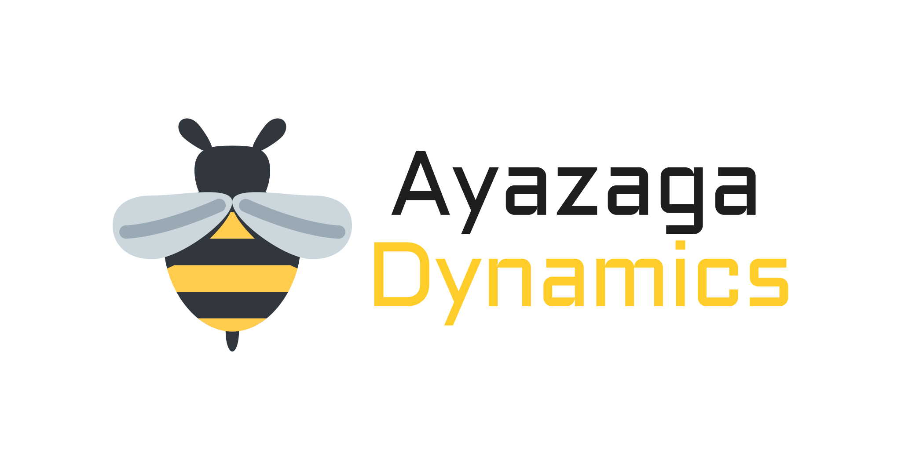

<!-- Improved compatibility of back to top link: See: https://github.com/othneildrew/Best-README-Template/pull/73 -->

<a name="readme-top"></a>

<!--
*** Thanks for checking out the Best-README-Template. If you have a suggestion
*** that would make this better, please fork the repo and create a pull request
*** or simply open an issue with the tag "enhancement".
*** Don't forget to give the project a star!
*** Thanks again! Now go create something AMAZING! :D
-->

<!-- PROJECT SHIELDS -->
<!--
*** I'm using markdown "reference style" links for readability.
*** Reference links are enclosed in brackets [ ] instead of parentheses ( ).
*** See the bottom of this document for the declaration of the reference variables
*** for contributors-url, forks-url, etc. This is an optional, concise syntax you may use.
*** https://www.markdownguide.org/basic-syntax/#reference-style-links
-->

[![Contributors][contributors-shield]][contributors-url]
[![Forks][forks-shield]][forks-url]
[![Stargazers][stars-shield]][stars-url]
[![Issues][issues-shield]][issues-url]
[![MIT License][license-shield]][license-url]
[![LinkedIn][linkedin-shield]][linkedin-url]

<!-- PROJECT LOGO -->
<br />
<div align="center">
  <a href="https://github.com/ayazagadynamics/repo_name">
    
  </a>

<h3 align="center">XBee-S3-Arduino</h3>

  <p align="center">

simple arduino library for interacting with Xbee S3 devices
<br />
<a href="https://github.com/ayazagadynamics/XBee-S3-Arduino/issues">Report Bug</a>
·
<a href="https://github.com/ayazagadynamics/repo_name/issues">Request Feature</a>

  </p>
</div>

<!-- TABLE OF CONTENTS -->
<details>
  <summary>Table of Contents</summary>
  <ol>
    <li>
      <a href="#about-the-project">About The Project</a>
      <ul>
        <li><a href="#built-with">Built With</a></li>
      </ul>
    </li>
    <li>
      <a href="#getting-started">Getting Started</a>
      <ul>
        <li><a href="#installation">Installation</a></li>
      </ul>
    </li>
    <li><a href="#usage">Usage</a></li>
    <li><a href="#contributing">Contributing</a></li>
    <li><a href="#license">License</a></li>
    <li><a href="#contact">Contact</a></li>
  </ol>
</details>

<!-- ABOUT THE PROJECT -->

## About The Project

This project is created because there was no official/unofficial XBee-S3 library when we started our mesh networking project. Currently the library is very raw but we hope to improve it over time with the help of the community.

<p align="right">(<a href="#readme-top">back to top</a>)</p>

<!-- GETTING STARTED -->

## Getting Started

This is document is prepared to help you. To get a local copy up and running follow these simple example steps. Please don't hesitate to ask questions in case of any problem.

### Installation

1. Download the library as a zip file.
2. In the Arduino IDE, navigate to Sketch > Include Library > Add . ZIP Library.
<!-- USAGE EXAMPLES -->

## Usage

First you need to create an `XBEE` instance. In order to optimize the performance, prevent unexpected behaviours and avoid memory fragmentation we used fixed payload size.

```
XBEE xbee(RX_PIN, TX_PIN, PAYLOAD_SIZE, BAUD_RATE);
```

<b>BROADCAST MESSAGE</b>

```
xbee.broadcast(payload);
```

<b>MESSAGING COORDINATOR</b>

```
xbee.message_to_coordinator(payload);
```

<b>CUSTOM DESTINATION</b>

```
xbee.message(payload, address);
```

_For more examples, please refer to the [examples](./examples/)_

<p align="right">(<a href="#readme-top">back to top</a>)</p>

## Contributing

Contributions are what make the open source community such an amazing place to learn, inspire, and create. Any contributions you make are **greatly appreciated**.

If you have a suggestion that would make this better, please fork the repo and create a pull request. You can also simply open an issue with the tag "enhancement".
Don't forget to give the project a star! Thanks again!

1. Fork the Project
2. Create your Feature Branch (`git checkout -b feature/AmazingFeature`)
3. Commit your Changes (`git commit -m 'Add some AmazingFeature'`)
4. Push to the Branch (`git push origin feature/AmazingFeature`)
5. Open a Pull Request

<p align="right">(<a href="#readme-top">back to top</a>)</p>
<!-- LICENSE -->

## License

Distributed under the MIT License. See `LICENSE.txt` for more information.

<p align="right">(<a href="#readme-top">back to top</a>)</p>

<!-- CONTACT -->

## Contact

Alperen Serkan Aksoz - a.serkanaksoz@gmail.com

Ahmet Fatih Akcan - afatihakcan@gmail.com

<p align="right">(<a href="#readme-top">back to top</a>)</p>

<!-- MARKDOWN LINKS & IMAGES -->
<!-- https://www.markdownguide.org/basic-syntax/#reference-style-links -->

[contributors-shield]: https://img.shields.io/github/contributors/ayazagadynamics/repo_name.svg?style=for-the-badge
[contributors-url]: https://github.com/ayazagadynamics/repo_name/graphs/contributors
[forks-shield]: https://img.shields.io/github/forks/ayazagadynamics/repo_name.svg?style=for-the-badge
[forks-url]: https://github.com/ayazagadynamics/repo_name/network/members
[stars-shield]: https://img.shields.io/github/stars/ayazagadynamics/repo_name.svg?style=for-the-badge
[stars-url]: https://github.com/ayazagadynamics/repo_name/stargazers
[issues-shield]: https://img.shields.io/github/issues/ayazagadynamics/repo_name.svg?style=for-the-badge
[issues-url]: https://github.com/ayazagadynamics/XBee-S3-Arduino/issues
[license-shield]: https://img.shields.io/github/license/ayazagadynamics/repo_name.svg?style=for-the-badge
[license-url]: https://github.com/ayazagadynamics/repo_name/blob/master/LICENSE.txt
[linkedin-shield]: https://img.shields.io/badge/-LinkedIn-black.svg?style=for-the-badge&logo=linkedin&colorB=555
[linkedin-url]: https://linkedin.com/company/ayazagadynamics
[product-screenshot]: images/screenshot.png
[next.js]: https://img.shields.io/badge/next.js-000000?style=for-the-badge&logo=nextdotjs&logoColor=white
[next-url]: https://nextjs.org/
[react.js]: https://img.shields.io/badge/React-20232A?style=for-the-badge&logo=react&logoColor=61DAFB
[react-url]: https://reactjs.org/
[vue.js]: https://img.shields.io/badge/Vue.js-35495E?style=for-the-badge&logo=vuedotjs&logoColor=4FC08D
[vue-url]: https://vuejs.org/
[angular.io]: https://img.shields.io/badge/Angular-DD0031?style=for-the-badge&logo=angular&logoColor=white
[angular-url]: https://angular.io/
[svelte.dev]: https://img.shields.io/badge/Svelte-4A4A55?style=for-the-badge&logo=svelte&logoColor=FF3E00
[svelte-url]: https://svelte.dev/
[laravel.com]: https://img.shields.io/badge/Laravel-FF2D20?style=for-the-badge&logo=laravel&logoColor=white
[laravel-url]: https://laravel.com
[bootstrap.com]: https://img.shields.io/badge/Bootstrap-563D7C?style=for-the-badge&logo=bootstrap&logoColor=white
[bootstrap-url]: https://getbootstrap.com
[jquery.com]: https://img.shields.io/badge/jQuery-0769AD?style=for-the-badge&logo=jquery&logoColor=white
[jquery-url]: https://jquery.com
